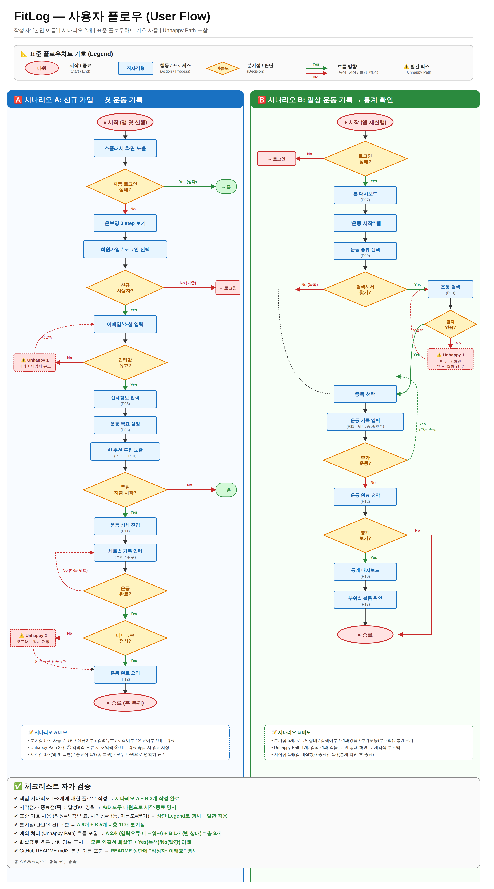
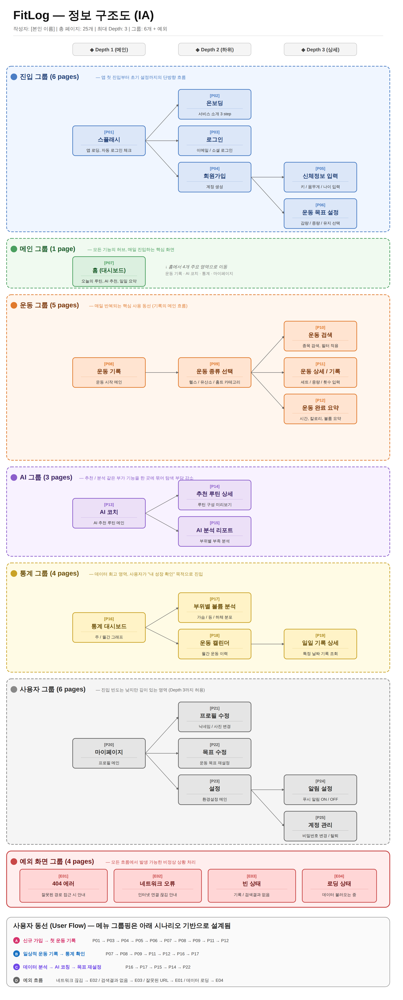

# 🏋️ FitLog - 운동 기록 앱 설계 과제 모음

**작성자: 이태호**

> 종합형 운동 기록 앱(헬스 + 유산소 + 홈트) FitLog의 IA 설계 및 사용자 플로우 설계 과제 통합 레포입니다.

## 📌 미션 목록

| 미션 | 주제 | 산출물 |
|------|------|--------|
| Mission 03 | IA(정보 구조) 제작 | [`sitemap.png`](./sitemap.png) |
| Mission 04 | 사용자 플로우 설계 | [`userflow.png`](./userflow.png) |

---

# 🅼🅾🅽4 Mission 04 — 사용자 플로우 설계

## 🗺️ User Flow

## 🎯 핵심 시나리오 (2개)

### 🅰️ 시나리오 A: 신규 가입 → 첫 운동 기록
**목표 달성 = 첫 운동 완료 후 요약 화면 도달**

김초보(28세, 헬스 입문)가 앱을 처음 실행 → 온보딩 → 회원가입 → 신체정보/목표 입력 → AI 추천 루틴 확인 → 첫 운동 기록 → 완료 요약 확인

- **시작점**: 앱 첫 실행 (타원)
- **종료점**: 운동 완료 요약 → 홈 복귀 (타원)
- **주요 분기점 6개**: 자동로그인 / 신규여부 / 입력유효 / 시작여부 / 완료여부 / 네트워크
- **Unhappy Path 2개**:
  - ⚠️ 입력값 오류 → 에러 메시지 → 재입력 루프백
  - ⚠️ 네트워크 끊김 → 오프라인 임시 저장 → 연결 복구 후 동기화

### 🅱️ 시나리오 B: 일상 운동 기록 → 통계 확인
**목표 달성 = 운동 완료 후 통계 대시보드에서 부위별 볼륨 확인**

박중급(34세, 헬스 2년차)이 출근 전 헬스장 → 로그인 상태로 홈 진입 → 운동 종류 선택 → 종목 검색 또는 목록 선택 → 세트별 기록 → 추가 운동 반복 → 완료 후 통계 확인

- **시작점**: 앱 재실행 (타원)
- **종료점**: 통계 확인 후 종료 (타원)
- **주요 분기점 5개**: 로그인상태 / 검색여부 / 결과있음 / 추가운동(루프백) / 통계보기
- **Unhappy Path 1개**:
  - ⚠️ 검색 결과 없음 → 빈 상태 화면 → 재검색 루프백

## 📐 표준 플로우차트 기호 사용

| 기호 | 의미 | 사용 예시 |
|------|------|----------|
| 🟥 **타원** | 시작 / 종료 | "시작 (앱 첫 실행)", "종료 (홈 복귀)" |
| 🟦 **직사각형** | 행동 / 프로세스 | "이메일 입력", "운동 기록 입력" |
| 🟧 **마름모** | 분기점 / 판단 | "자동 로그인 상태?", "검색 결과 있음?" |
| ➡️ **화살표** | 흐름 방향 | 녹색=Yes(정상), 빨강=No(예외) |

## 🌊 흐름 방향 표기 규칙

- 모든 연결선에 **화살표 머리** 표시
- 분기점에서 나오는 모든 화살표에 **Yes/No 라벨** 명시
- **녹색**: 정상(Happy Path) 흐름
- **빨강**: 예외(Unhappy Path) 흐름 + 점선 처리

## ⚠️ Unhappy Path (예외 처리) 설계 근거

총 **3개의 예외 흐름**을 포함했습니다.

1. **시나리오 A - 입력값 오류**: 회원가입 시 이메일 형식 오류 등 → 에러 메시지 노출 후 입력 화면으로 루프백
2. **시나리오 A - 네트워크 끊김**: 운동 완료 시점에 인터넷 끊김 → 로컬에 임시 저장 → 연결 복구 시 자동 동기화 (사용자 데이터 손실 방지)
3. **시나리오 B - 검색 결과 없음**: 운동 종목 검색 시 매칭 결과 0건 → 빈 상태 화면("검색 결과 없음") → 재검색 유도

## ✅ Mission 04 체크리스트 자가 검증

- [x] **핵심 시나리오 1~2개에 대한 플로우우가 작성되었는가** → 시나리오 A + B 2개 작성 완료
- [x] **시작점과 종료점(목표 달성)이 명확한가** → A/B 모두 타원으로 시작·종료 명시
- [x] **표준 기호가 사용되었는가 (타원=시작/종료, 직사각형=행동, 마름모=분기)** → 상단 Legend로 명시 + 일관 적용
- [x] **분기점(판단/조건)이 포함되었는가** → A 6개 + B 5개 = **총 11개 분기점**
- [x] **예외 처리 (Unhappy Path) 흐름이 포함되었는가** → A 2개 + B 1개 = **총 3개 예외 흐름**
- [x] **화살표로 흐름 방향이 명확하게 표시되었는가** → 모든 연결선 화살표 + Yes(녹색)/No(빨강) 라벨
- [x] **GitHub README.md에 본인 이름이 포함되었는가** → 상단 "작성자: 이태호" 명시

---

# 🅼🅾🅽3 Mission 03 — IA(정보 구조) 설계

## 📋 프로젝트 개요

| 항목 | 내용 |
|------|------|
| 서비스명 | FitLog |
| 컨셉 | 종합형 운동 기록 앱 (AI 코칭 + 통계 대시보드) |
| 타겟 | 헬스 입문자 ~ 중상급자 |
| 총 페이지 수 | **25개** (예외 화면 4개 별도) |
| 최대 Depth | **3단계** |
| 그룹 수 | 6개 + 예외 그룹 |

## 🗺️ 사이트맵

## 👥 사용자 시나리오

페이지는 다음 4가지 시나리오를 기반으로 도출했습니다.

### 🅰️ 시나리오 A: 신규 사용자 온보딩 → 첫 운동 기록
경로: P01 → P03 → P04 → P05 → P06 → P07 → P08 → P09 → P11 → P12

### 🅱️ 시나리오 B: 기존 사용자의 일상적 운동 기록 → 통계 확인
경로: P07 → P08 → P09 → P11 → P12 → P16 → P17

### 🅲️ 시나리오 C: 데이터 분석 → AI 코칭 → 목표 재설정
경로: P16 → P17 → P15 → P14 → P22

### 🅳️ 시나리오 D: 예외 흐름
네트워크 끊김(E02) / 검색 결과 없음(E03) / 잘못된 URL 접근(E01) / 데이터 로딩(E04)

## ✅ Mission 03 체크리스트 자가 검증

- [x] 시나리오 기반으로 필요한 페이지가 빠짐없이 도출되었는가 → 시나리오 4개 → 25개 페이지 매핑
- [x] 3단계(Depth 3) 이상의 계층 구조로 되어있는가 → 8개 페이지가 Depth 3
- [x] 화면(페이지) 수가 10개 이상인가 → 25개
- [x] 각 노드에 화면 이름과 핵심 기능이 표기되었는가 → 모든 노드에 [ID] + 이름 + 기능 명시
- [x] 유사 페이지가 논리적으로 그룹핑되었는가 → 6개 그룹 + 예외 그룹
- [x] 메뉴 그룹핑이 사용자 동선을 고려했는가 → 시나리오 A/B/C 동선 명시
- [x] 예외 화면(에러, 빈 상태 등)이 포함되었는가 → E01~E04 4개 별도 그룹
- [x] GitHub README.md에 본인 이름이 포함되었는가 → 상단 "작성자: 이태호" 명시
