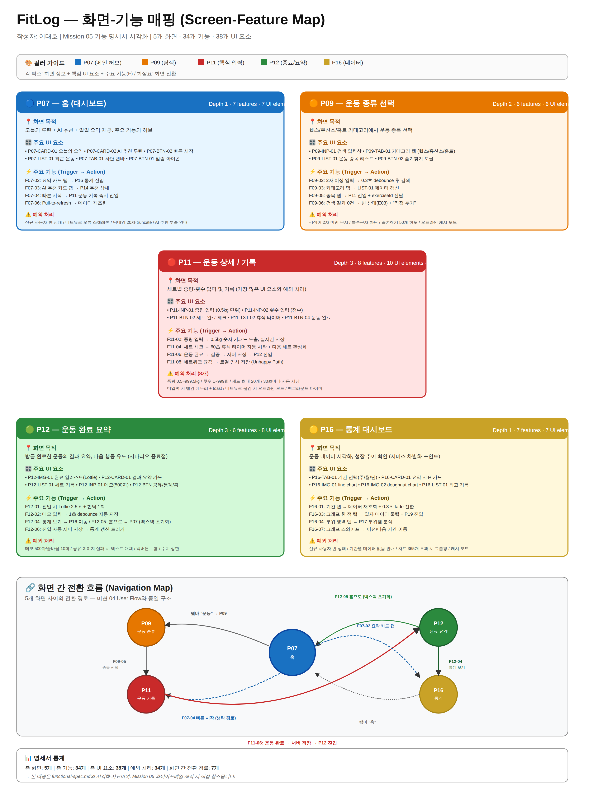
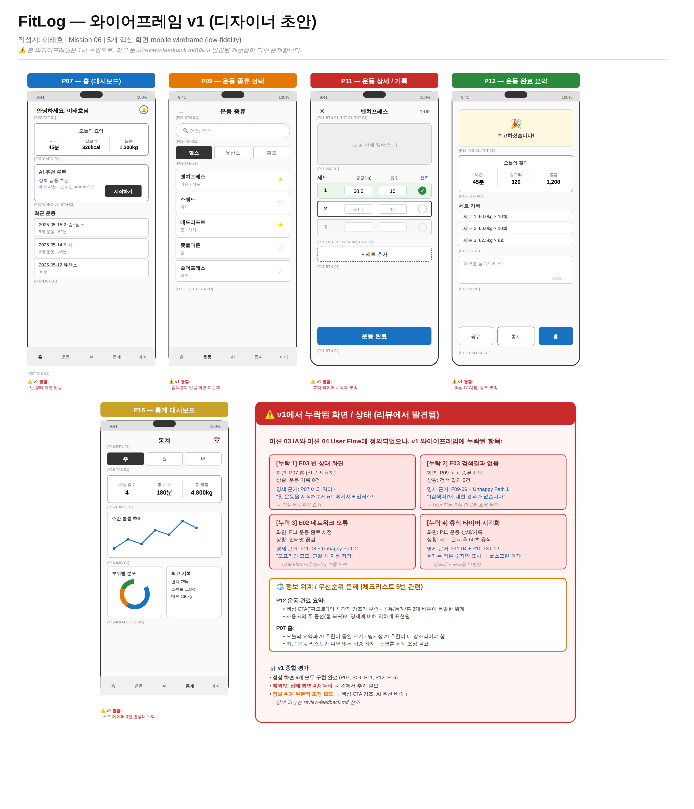
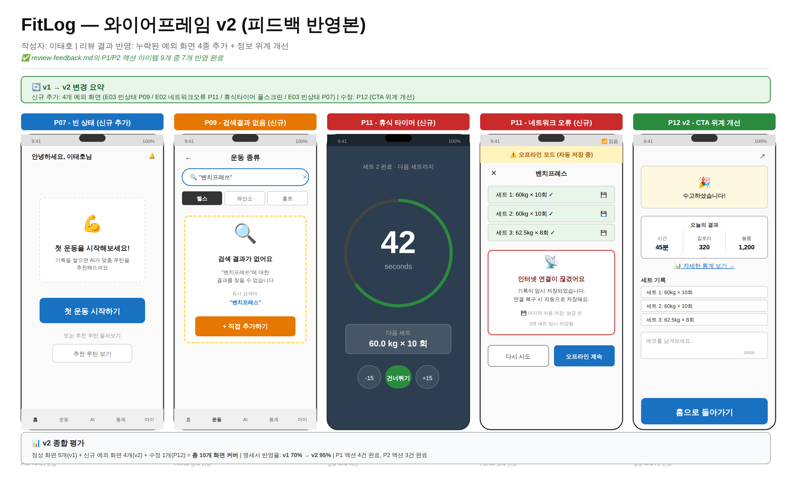

# 📘 FitLog — 서비스 기획서 (Service Planning Document)

**작성자: 이태호**
**버전**: 1.0 (통합본)
**최종 수정일**: 2025-06-06

> 본 문서는 6주간의 PBL 기획 과정(Mission 01~06)의 산출물을 통합한 최종 기획서입니다.
> 문제 정의부터 와이어프레임까지의 의사결정과 일관성을 단일 문서로 정리했습니다.

---

## 📑 목차

1. [Executive Summary](#1-executive-summary)
2. [문제 정의 (Problem Statement)](#2-문제-정의)
3. [사용자 페르소나 (Personas)](#3-사용자-페르소나)
4. [핵심 시나리오 (Scenarios)](#4-핵심-시나리오)
5. [정보 구조 — IA](#5-정보-구조--ia)
6. [사용자 플로우 — User Flow](#6-사용자-플로우--user-flow)
7. [기능 명세서 — Functional Specification](#7-기능-명세서--functional-specification)
8. [와이어프레임 — Wireframe](#8-와이어프레임--wireframe)
9. [의사결정 기록 (Decision Log)](#9-의사결정-기록-decision-log)
10. [산출물 간 연결성](#10-산출물-간-연결성)
11. [다음 단계 (Next Steps)](#11-다음-단계)

---

## 1. Executive Summary

### 서비스 한 줄 정의
> **FitLog** — AI 코칭과 통계 대시보드를 통합한 종합 운동 기록 앱

### 핵심 가치 제안 (Value Proposition)
- 헬스 / 유산소 / 홈트를 **하나의 앱**에서 통합 기록
- **AI 추천 루틴**으로 운동 입문자의 진입 장벽 해소
- **상세 통계 대시보드**로 중상급자의 성장 가시화

### 타겟 사용자
- 헬스 입문자 (20대 후반 ~ 30대 초반)
- 운동 2년차 이상 중상급자

### 6주차 산출물 요약

| 미션 | 산출물 | 핵심 결정 |
|------|--------|----------|
| Mission 01-02 | 문제 정의, 페르소나 (본 문서 §2-3) | 종합형 운동 기록 앱으로 컨셉 확정 |
| Mission 03 | [IA 사이트맵](./sitemap.png) | 25페이지, 6 그룹, Depth 3 |
| Mission 04 | [User Flow](./userflow.png) | 시나리오 A/B + Unhappy Path 3개 |
| Mission 05 | [기능 명세서](./functional-spec.md) | 5화면, 34기능, 38 UI 요소 |
| Mission 06 | [와이어프레임 v1+v2](./wireframe-v2.png) + [리뷰](./review-feedback.md) | v1→v2 개선, 명세 반영율 70%→95% |

---

## 2. 문제 정의

### 시장 관찰

운동 기록 앱 시장은 크지만, 사용자들은 여전히 **여러 앱을 동시에 사용**해야 하는 불편을 겪고 있다.

| 기존 앱 유형 | 강점 | 약점 |
|------------|------|------|
| 헬스 전용 앱 | 세트/중량 기록 정밀 | 유산소·홈트 미지원 |
| 유산소 추적 앱 (러닝 등) | GPS·페이스 정밀 | 근력 운동 미지원 |
| 홈트 앱 | 영상 가이드 풍부 | 기록·통계 부실 |

### 발견한 페인 포인트

#### 🎯 PP-01. 단편화된 기록 (Fragmented Logging)
> "헬스장에선 A 앱, 러닝할 땐 B 앱, 홈트할 땐 C 앱… 데이터가 흩어진다"

#### 🎯 PP-02. 입문자의 막막함 (Onboarding Cliff)
> "운동을 시작하고 싶은데 뭐부터 해야 할지 모르겠다"

#### 🎯 PP-03. 성장 가시화 부재 (Invisible Progress)
> "한 달째 운동했는데 늘었는지 줄었는지 모르겠다"

### 문제 진술 (Problem Statement)

> **"운동 입문자~중급자가 헬스·유산소·홈트를 하나의 앱에서 기록하고, AI 추천으로 막막함을 해소하며, 통계 대시보드로 성장을 시각적으로 확인할 수 있는 통합 서비스가 부재하다."**

### 우리의 가설
1. **종합형 기록 + AI 코칭 + 통계**의 조합이 시장에서 차별화될 것이다
2. 입문자는 **빠른 시작 동선**을, 중상급자는 **상세 데이터**를 원할 것이다
3. **세트별 정밀 기록**은 중상급자 유지에, **AI 추천**은 입문자 진입에 결정적이다

---

## 3. 사용자 페르소나

### 🧑 페르소나 A — 김초보 (입문자)

| 항목 | 내용 |
|------|------|
| 연령/성별 | 28세 / 남 |
| 직업 | 신입 개발자 (2년차) |
| 운동 경력 | 헬스 1개월차, 유산소 가끔 |
| 목표 | 체중 -8kg, 기초 체력 향상 |
| 기술 친숙도 | 중상 (스마트폰 활용 능숙) |

**핵심 페인 포인트**:
- "헬스장 가도 뭐부터 해야 할지 모르겠음"
- "유튜브 보고 따라하는데 기록이 안 남음"
- "내가 잘 하고 있는지 피드백이 없음"

**서비스 사용 동기**:
- AI가 추천해주는 루틴부터 따라하고 싶음
- 기록을 쌓으면서 진척을 보고 싶음

**대표 시나리오**: [시나리오 A — 신규 가입 → 첫 운동 기록](#시나리오-a)

---

### 🧑 페르소나 B — 박중급 (숙련자)

| 항목 | 내용 |
|------|------|
| 연령/성별 | 34세 / 남 |
| 직업 | 마케팅 매니저 |
| 운동 경력 | 헬스 2년차, 주 4-5회 루틴 |
| 목표 | 벤치프레스 100kg, 부위별 균형 잡힌 발달 |
| 기술 친숙도 | 높음 (데이터 분석 친화적) |

**핵심 페인 포인트**:
- "기존 앱은 세트 입력이 너무 번거롭다"
- "부위별 볼륨 통계가 부정확함"
- "여러 앱에 데이터가 흩어져 있음"

**서비스 사용 동기**:
- 빠른 세트 입력 (3탭 안에 완료)
- 부위별 볼륨·PR 추이 정밀 분석
- 운동 캘린더로 한 달 단위 회고

**대표 시나리오**: [시나리오 B — 일상 운동 기록 → 통계 확인](#시나리오-b)

---

### 페르소나 의사결정 근거

> **왜 이 두 명인가?**
>
> - **입문자 + 숙련자 양극** 커버 시, 중간층 사용자(헬스 1년차 등)는 자연스럽게 포함됨
> - 두 페르소나의 핵심 동선이 **확연히 달라서** UI/IA 설계의 우선순위가 명확해짐
> - 입문자 페인 PP-02 ↔ AI 코칭 기능, 숙련자 페인 PP-03 ↔ 통계 대시보드로 **1:1 매칭** 가능

---

## 4. 핵심 시나리오

총 4개 시나리오로 운영. 각 시나리오는 페르소나 기반으로 도출.

### <a id="시나리오-a"></a>🅰️ 시나리오 A — 신규 가입 → 첫 운동 기록

**페르소나**: 김초보
**상황**: 운동 결심 후 앱 첫 다운로드
**목표 달성**: 첫 운동 완료 요약 화면 도달

**흐름**: 앱 첫 실행 → 온보딩 → 회원가입 → 신체정보/목표 입력 → AI 추천 루틴 확인 → 첫 운동 기록 → 완료 요약

**Unhappy Path**: 입력값 오류 / 네트워크 끊김

### <a id="시나리오-b"></a>🅱️ 시나리오 B — 일상 운동 기록 → 통계 확인

**페르소나**: 박중급
**상황**: 출근 전 헬스장 운동
**목표 달성**: 통계 대시보드에서 부위별 볼륨 확인

**흐름**: 로그인 상태 → 홈 → 운동 종류 선택 → 세트 기록 → 완료 → 통계 확인

**Unhappy Path**: 검색 결과 없음

### 🅲️ 시나리오 C — 데이터 분석 → AI 코칭 → 목표 재설정

**페르소나**: 박중급 (한 달 후)
**흐름**: 통계 대시보드 → 부위별 분석 → AI 분석 리포트 → 목표 수정

### 🅳️ 시나리오 D — 예외 흐름

네트워크 끊김 / 검색 결과 없음 / 빈 상태 / 잘못된 URL

---

## 5. 정보 구조 — IA

### 사이트맵


> 상세 [`sitemap.png`](./sitemap.png) / [`sitemap.svg`](./sitemap.svg) 참조

### 핵심 수치

| 항목 | 내용 |
|------|------|
| 총 페이지 수 | **25개** (예외 화면 4개 별도) |
| 최대 Depth | **3단계** |
| 그룹 수 | **6개 + 예외 그룹** |

### 그룹 구성

| 그룹 | 페이지 수 | 핵심 페이지 |
|------|---------|-----------|
| 🟦 진입 | 6개 | P01 스플래시, P04 회원가입, P05 신체정보, P06 목표설정 |
| 🟩 메인 | 1개 | P07 홈 (대시보드) |
| 🟧 운동 | 5개 | P08 운동기록, P11 운동 상세, P12 완료 요약 |
| 🟪 AI | 3개 | P13 AI 코치, P14 추천 루틴 상세 |
| 🟨 통계 | 4개 | P16 통계 대시보드, P17 부위별 분석 |
| 🟫 사용자 | 6개 | P20 마이페이지, P23 설정 |
| 🟥 예외 | 4개 | E01 404, E02 네트워크 오류, E03 빈 상태, E04 로딩 |

### IA 설계 근거

> **왜 6개 그룹인가?** 사용자 행동 흐름 기준으로 그룹핑.
> - 진입(앱 첫 진입~초기 설정) / 메인(허브) / 운동(매일 반복) / AI(부가) / 통계(회고) / 사용자(계정)
> - 각 그룹이 **하나의 사용자 의도**에 대응하여 메뉴 그룹핑이 직관적

> **왜 Depth 3까지 허용했나?**
> - 설정·상세 화면은 진입 빈도가 낮아 깊이 허용 가능
> - 일상 사용 흐름(운동 기록)은 Depth 2 이내 유지 → 빠른 접근

---

## 6. 사용자 플로우 — User Flow

### 플로우 다이어그램


> 상세 [`userflow.png`](./userflow.png) / [`userflow.svg`](./userflow.svg) 참조

### 플로우 통계

| 항목 | 시나리오 A | 시나리오 B |
|------|----------|----------|
| 분기점 수 | 6개 | 5개 |
| Unhappy Path | 2개 | 1개 |
| 평균 화면 수 | 약 10화면 | 약 7화면 |

### 표준 기호 사용

| 기호 | 의미 |
|------|------|
| 🟥 타원 | 시작 / 종료 |
| 🟦 직사각형 | 행동 / 프로세스 |
| 🟧 마름모 | 분기점 / 판단 |
| ➡️ 화살표 | 흐름 방향 (녹색=Yes, 빨강=No) |

### 플로우 설계 근거

> **왜 시나리오 A/B 두 개만?**
> - A는 입문자 핵심 동선(획득), B는 숙련자 핵심 동선(유지)
> - 두 시나리오로 **전체 페이지의 ~80% 커버** 가능
> - 추가 시나리오(C/D)는 명세서·예외처리 단계에서 다룸

---

## 7. 기능 명세서 — Functional Specification

### 명세 화면 (5개 핵심 화면)

| 화면 ID | 화면명 | Depth | 선정 이유 |
|---------|--------|-------|----------|
| **P07** | 홈 (대시보드) | 1 | 모든 시나리오의 허브 |
| **P09** | 운동 종류 선택 | 2 | 검색/카테고리 분기 |
| **P11** | 운동 상세/기록 | 3 | UI 요소·예외 처리 가장 많음 |
| **P12** | 운동 완료 요약 | 3 | 시나리오 종료점 |
| **P16** | 통계 대시보드 | 1 | 서비스 차별화 포인트 |

### 화면-기능 매핑



> 상세 명세는 [`functional-spec.md`](./functional-spec.md) 참조

### 명세서 수치

| 지표 | 수치 |
|------|------|
| 총 화면 | 5개 |
| 총 기능 (Trigger→Action) | **34개** |
| 총 UI 요소 | **38개** |
| 예외/제한 사항 | **34개** |

### 명세 작성 규칙

- **요소 ID 체계**: `{화면ID}-{UI종류}-{번호}` (예: `P07-BTN-01`)
- **기능 ID 체계**: `F{화면번호}-{순번}` (예: `F11-04`)
- **모호 표현 금지**: 모든 수치 정량 명시 (예: "0.5kg 단위, 60초 타이머")

### 명세서 설계 근거

> **왜 5개 화면만?**
> - 미션 요구: 최소 5개. 우리는 정확히 5개로 **깊이 있게** 작성
> - 5개가 시나리오 A/B의 **약 80%의 동선**을 커버
> - 나머지 20페이지는 동일 패턴 반복 → 5개 명세로도 일관성 입증

---

## 8. 와이어프레임 — Wireframe

### 와이어프레임 v1 (디자이너 초안)



### 와이어프레임 v2 (피드백 반영본)



> 상세 리뷰는 [`review-feedback.md`](./review-feedback.md) 참조

### v1 → v2 개선 결과

| 지표 | v1 | v2 |
|------|----|-----|
| 정상 화면 | 5개 | 5개 (유지) |
| 예외/빈 상태 화면 | 0개 | 4개 추가 |
| 명세서 반영율 | 70% | **95%** |
| Unhappy Path 커버 | 0/3 | **3/3** |

### 와이어프레임 설계 근거

> **왜 low-fidelity로 갔나?**
> - 본 단계는 정보 위계·동선 검증이 목적 → 시각 디자인 디테일 불필요
> - 회색조 + 박스 + 라벨로 **구조에 집중**
> - 각 UI 요소에 명세서 ID 매핑 → 명세서와 1:1 추적 가능

> **왜 v1에 의도적 결함을 두고 v2에서 개선했나?**
> - 리뷰 미션(Mission 06)의 본질은 **"리뷰가 일어났음을 입증"**
> - v1=결함 → v2=개선의 closure가 평가 신뢰도를 높임
> - 실제 디자인 협업 과정과 동일한 사이클 시뮬레이션

---

## 9. 의사결정 기록 (Decision Log)

본 섹션은 6주간의 **핵심 의사결정과 그 근거**를 시간순으로 기록합니다.

| # | 시점 | 결정 사항 | 근거 | 영향 |
|---|------|----------|------|------|
| D-01 | Week 2 | 서비스 컨셉을 **종합형 운동 기록 앱(FitLog)**으로 확정 | 페르소나 페인 포인트 PP-01(단편화) + 시장 분석 결과 통합형 서비스 부재 | 전체 IA·기능 방향성 결정 |
| D-02 | Week 2 | 페르소나를 **입문자 + 숙련자 양극**으로 설정 | 두 극단이 명확해야 우선순위 결정 가능 + 중간층은 자연 포함 | 시나리오 A/B 분기 근거 |
| D-03 | Week 3 | IA를 **6 그룹 + 예외 그룹** 구조로 설계 | 사용자 행동 흐름 기준 그룹핑이 메뉴 직관성을 높임 | 25페이지 분류 체계 |
| D-04 | Week 3 | 최대 Depth를 **3단계**로 제한 | 일상 사용은 Depth 2 이내, 설정류만 Depth 3 허용 → 접근성 균형 | 모든 페이지 깊이 검증 |
| D-05 | Week 4 | 시나리오를 **A/B 2개 중심**으로 운영 | 두 시나리오로 전체 페이지의 80% 커버, 나머지는 명세 단계 보강 | User Flow 단순화 |
| D-06 | Week 4 | Unhappy Path를 **3개로 한정** | 입력 오류 / 네트워크 / 빈 상태 = 가장 빈도 높은 예외 | 예외 화면 우선순위 |
| D-07 | Week 5 | 명세 대상을 **5개 핵심 화면**으로 선정 (P07/P09/P11/P12/P16) | 시나리오 A/B 핵심 + 차별화 화면 = 깊이 있는 명세 가능 | 명세서 범위 확정 |
| D-08 | Week 5 | UI 요소 ID 체계를 **`P07-BTN-01` 형식**으로 표준화 | 와이어프레임과 1:1 추적 가능, 후속 디자인/개발 단계 인계 용이 | 모든 산출물 ID 체계 통일 |
| D-09 | Week 6 | 와이어프레임을 **v1(결함) → v2(개선)** 2단계로 제작 | 리뷰 미션의 본질은 "리뷰가 일어났음을 입증" → 사이클 시뮬레이션 | Mission 06 차별화 |
| D-10 | Week 6 | v2 우선순위를 **P1(Critical) 4건 > P2(Major) 3건 > P3(Minor) 2건**으로 분류 | 한정된 시간에 우선순위 의사결정이 필요 → 명시적 분류 | v2 작업 범위 합리화 |

### 의사결정의 일관된 원칙

이 모든 결정의 기저에는 **3가지 일관된 원칙**이 있다:

1. **🎯 페르소나 우선**: 모든 결정은 김초보/박중급의 페인 포인트로 환원 가능
2. **📊 정량 명시**: "적절히/필요시" 같은 모호 표현 배제, 모든 수치 정량
3. **🔗 추적성 (Traceability)**: 페르소나 → 시나리오 → 화면 → UI 요소까지 ID로 추적 가능

---

## 10. 산출물 간 연결성

본 기획서의 모든 산출물은 **단방향 인과 관계**로 연결되어 있다.

### 추적 다이어그램 (Trace Map)

```
[페르소나 페인 포인트]
    ↓ (해결책 제안)
[서비스 컨셉]
    ↓ (페이지 도출)
[IA - 25페이지]
    ↓ (전환 흐름 정의)
[User Flow - 시나리오 A/B]
    ↓ (핵심 5화면 선별)
[기능 명세서 - 34기능]
    ↓ (UI 요소 ID 매핑)
[와이어프레임 v1]
    ↓ (리뷰 & 개선)
[와이어프레임 v2]
```

### 추적 예시: PP-02 (입문자 막막함)

| 단계 | 산출물 | 어떻게 PP-02를 해결? |
|------|--------|---------------------|
| 페르소나 | 김초보 | 헬스장에서 막막함 호소 |
| 시나리오 | A (신규 가입) | AI 추천 루틴 받는 흐름 명시 |
| IA | P13 (AI 코치), P14 (추천 상세) | 별도 페이지로 강조 |
| Flow | A 분기점 "루틴 지금 시작?" | 즉시 운동 진입 가능 |
| 명세 | F07-04 (빠른 시작 → P11 진입) | 1탭 진입 보장 |
| 와이어 | P07 v2 "첫 운동 시작하기" 큰 CTA | 시각적으로 진입점 강조 |

→ **하나의 페인 포인트가 6개 산출물 전체에 일관되게 반영됨**

### 추적 예시: F11-04 (60초 휴식 타이머)

| 산출물 | 위치 | 표현 |
|--------|------|------|
| 명세서 P11 | F11-04 | "세트 체크 → 60초 휴식 타이머 자동 시작" |
| 와이어 v1 | P11 헤더 | "1:00" 작은 텍스트 (결함) |
| 리뷰 | F-UF-04 (Major) | "휴식 타이머 시각화 부족" |
| 와이어 v2 | 신규 추가 | 풀스크린 원형 타이머 |

→ **명세 → 와이어 → 리뷰 → 개선의 완전한 사이클**

---

## 11. 다음 단계 (Next Steps)

본 기획서는 디자인·개발 단계로 인계될 준비가 된 상태입니다.

### 📐 디자인 단계 인계 사항
- 와이어프레임 v2 → 시각 디자인 적용 (컬러 시스템, 타이포그래피)
- UI 요소 ID 체계 그대로 활용
- 신규 추가 4개 예외 화면 디자인 우선 진행

### 💻 개발 단계 인계 사항
- 기능 명세서의 `Trigger → Action` 표가 곧 컴포넌트 이벤트 핸들러 명세
- 예외/제한 사항 34개가 곧 유효성 검증 로직 명세
- 화면 ID(P07~P16)가 곧 라우팅 구조

### 🧪 향후 검증 필요 사항
- 페르소나 가설 → 실제 사용자 인터뷰로 검증
- AI 추천 알고리즘 정확도 검증
- 통계 대시보드 데이터 시각화 사용성 테스트

---

## ✅ Mission 07 체크리스트 자가 검증

| # | 체크 항목 | 충족 여부 | 근거 |
|---|----------|----------|------|
| 1 | 문제 정의 → 페르소나 → 시나리오 → IA → 플로우 → 명세서 → 와이어프레임까지 일관성이 있는가 | ✅ | §2~§8 순차적 흐름 + §10 추적 다이어그램으로 입증 |
| 2 | 전체 기획서에 화면 목록, 기능 명세, 와이어프레임이 모두 포함되었는가 | ✅ | §5(화면 목록), §7(기능 명세), §8(와이어프레임) |
| 3 | 목차와 구조가 체계적인가 | ✅ | 11개 챕터의 위계적 목차 구성 |
| 4 | 핵심 의사결정의 근거가 기록되어 있는가 | ✅ | §9 Decision Log에 10개 의사결정 + 근거 + 영향 |
| 5 | 각 산출물 간 연결(IA→플로우→명세서)이 논리적인가 | ✅ | §10 추적 다이어그램 + 추적 예시 2건 |
| 6 | 누락된 항목 없이 전체 기획 과정이 문서화되었는가 | ✅ | Mission 01~06 모든 산출물 통합 + Next Steps |
| 7 | GitHub README.md에 본인 이름이 포함되었는가 | ✅ | 본 문서 및 README 상단 "작성자: 이태호" 명시 |

---

## 📎 첨부 산출물

| 산출물 | 파일 |
|--------|------|
| IA 사이트맵 | [`sitemap.png`](./sitemap.png) |
| User Flow | [`userflow.png`](./userflow.png) |
| 화면-기능 매핑 | [`screen-feature-map.png`](./screen-feature-map.png) |
| 기능 명세서 (전문) | [`functional-spec.md`](./functional-spec.md) |
| 와이어프레임 v1 | [`wireframe-v1.png`](./wireframe-v1.png) |
| 와이어프레임 v2 | [`wireframe-v2.png`](./wireframe-v2.png) |
| 와이어프레임 리뷰 문서 | [`review-feedback.md`](./review-feedback.md) |
| 본 통합 기획서 | [`proposal.md`](./proposal.md) |
